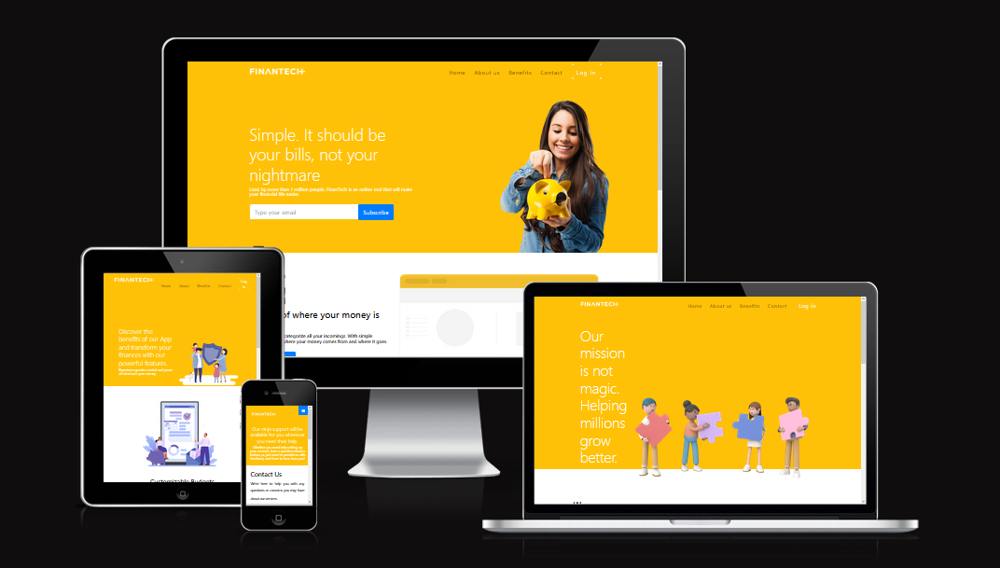
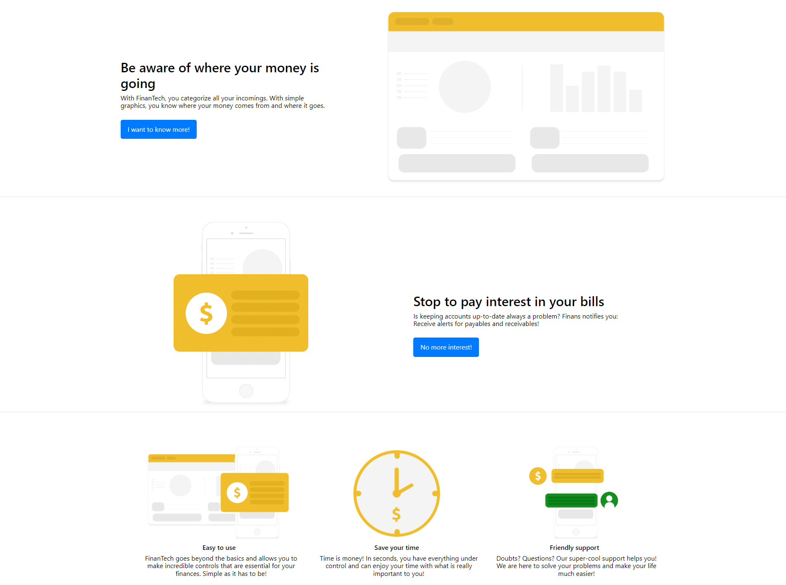

# FinanTech
FinanTech is an online financial management tool used by over one million people to simplify their financial life. It helps users categorize their income and expenses, track where their money is going, and receive alerts for payables and receivables.

 The website features a user-friendly interface with simple graphics to help users better understand their financial situation. Additionally, users can subscribe to FinanTech by providing their email address on the website.

# Features
- Navigation
  - At the top of the page, the logo of the company is on the left side, that links to the main page (index.html).
  - The other part of the navigation links are to the right side: Home, About us, Benefits, Contact and Log in.
  - The navigation it is in a great style, clearly and easy to find.

# The Header
  - The heeader is yellow and highlight how the app can help to save money, and with a subscription form.

# The sections
  - The sections demonstrate what the user can achieve when is using the app.

# The footer
  - The footer is quite simple but provide all the necessary information to guide the user through the webpage and to go forward with the social media pages.

# The about us page
  - The "About Us" page is a section of a website that provides information about the company behind the website.
  - The page starts with a banner section that highlights the company's mission and introduces what the app offers. It also includes a visual element, an image of a group of team members working together, which helps to convey the company's collaborative spirit.
  - The main content of the "About Us" page explains what the FinanTech app does and why it was created. It emphasizes that the app is designed to help users manage their finances and achieve their financial goals, while also promoting personal growth and well-being. The page explains the app's key features, such as personalized insights and advice to help users save money, reduce debt, and cultivate healthy financial habits.
  - The page also includes a video, a call to action to download the app, and links to other sections of the website. Overall, the "About Us" page serves as an introduction to the company and its products, and helps to build trust and credibility with potential users.

# The benefits page
  - The page is divided into three sections, and each section highlights a different benefit. The first section, which is also the largest and most prominent, features a banner with an image of a group of people, presumably a family, and a quote that emphasizes the benefits of the app.
  - The quote encourages users to "Discover the benefits of our App and transform your finances with our powerful features," and promises that the app will provide users with greater control and peace of mind over their finances.
  - The second section highlights the customizable budgeting feature of the app. The section includes an image of an iPhone and a credit card, as well as a short blurb about how the app allows users to create customizable budgets based on their spending habits and financial goals.

# The contact page
  - The contact page is a section of the FinanTech website that provides a way for visitors to get in touch with the company. The page includes a contact form where users can fill out their name, email address, subject, and message. Once submitted, the message is sent to the company's email address for review and response.
  - The page also features a banner with a quote about the company's customer support and an image of a team of people working together. Additionally, there is a brief introduction to the purpose of the contact page and a message thanking users for choosing the company's finance app.

# Testing
  - I tested the pages in different broswers such as Firefox, Chrome, and Edge.
  - I confirm the pages are working and is responsive for all sizes of devices.
  - Navigation working perfectly and for small displays turning into a hamburger menu.

# Validator testing
  - HTML
    - No error were returned by the W3C validator.
  - CSS
    - No error were returned by the Jigsaw validator.

# Deployment
  - The site was deployed to GitHub pages.
  - THe live like can be found here: https://devalanaraki.github.io/CI-my-first-project

# Credits
  - The images used in the pages were taken from:
    - LOGO: https://portotechhub.com/finantech-is-now-a-new-member-of-porto-tech-hub-association/
    - WOMAN SAVING MONEY: https://br.freepik.com/psd-gratuitas/menina-poupar-dinheiro-para-o-futuro_938041.htm#query=woman%20with%20a%20euro%20coin&position=0&from_view=search&track=ais
    - GRAPHIC IMAGE: https://imgur.com/gallery/sjM1uXT
    - WEB CARD IMAGE: https://imgur.com/gallery/7Q8mAAx
    - ABOUT US IMAGE: https://br.freepik.com/psd-gratuitas/a-ilustracao-3d-do-homem-usa-um-ima-para-atrair-um-alvo_29210409.htm#query=about%20us&position=19&from_view=search&track=ais
    - BENEFITS PAGE: https://www.freepik.com/free-vector/health-insurance-template-vector-blog-banner_16261749.htm#page=5&query=benefits&position=37&from_view=search&track=sph
    - EASY BILL MANAGEMENT: https://br.freepik.com/vetores-gratis/mulher-preocupada-plana-tem-lista-de-dividas-de-credito-e-contas-vencidas-menina-lendo-carta-da-agencia-de-cobranca-sobre-problemas-financeiros-emprestimos-e-impostos-nao-pagos-calculo-e-pagamento-do-conceito-de-despesas_22654317.htm#query=Easy%20Bill%20Management&position=7&from_view=search&track=ais
    - CUSTOMIZABLE BUDGETS: https://www.freepik.com/free-vector/analysis-financial-activities-online-service-platform-business-character-reviewing-company-s-financial-operation-online-software-flat-vector-illustration_25523394.htm#query=Customizable%20Budgets&position=16&from_view=search&track=ais
    - PERSONALIZED INSIGHTS: https://www.freepik.com/free-vector/woman-worker-analyzing-digital-data-charts-graphs_20924612.htm#query=PERSONALIZED%20metrics&position=7&from_view=search&track=ais
    - INVESTIMENT TRACKING: https://www.freepik.com/free-vector/hand-drawn-stock-market-concept-with-arrow_20058513.htm#query=Investment%20Tracking&position=13&from_view=search&track=ais
    - CONTACT US: https://www.freepik.com/free-vector/flat-customer-support-illustration_13184991.htm#query=contact%20us&position=30&from_view=search&track=ais
